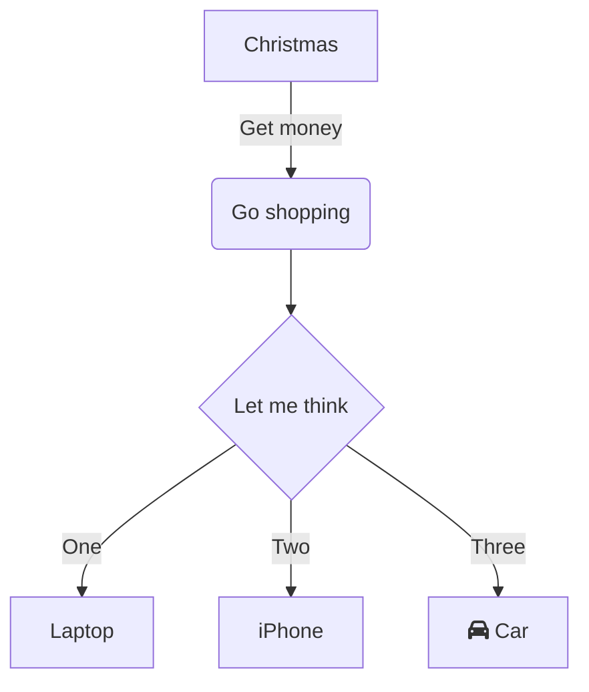
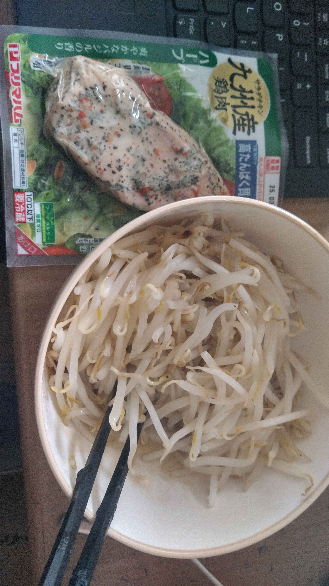

# h1

## h2

### h3

#### h4

##### h5

###### h6

text

<!--end_slide-->

# mermaid



<!--end_slide-->

# Active codeblock

if you want to exec code block: `Ctrl + e`

# rust

```rust +exec
fn main() {
    println!("Hello, World!");
}
```

# shell

```sh +exec
echo "Hello, World!"
```

# java

```java +exec
class Hello {
    public static void main(String[] args) {
        System.out.println("Hello, World!");
    }
}
```

<!--end_slide-->

# nodejs

```js +exec
console.log("Hello, World!");
```

# R

```r +exec
paste0("Hello, World!")
```

# python

```python +exec
print("Hello, World!")
```

<!--end_slide-->

# Image



<!--end_slide-->
